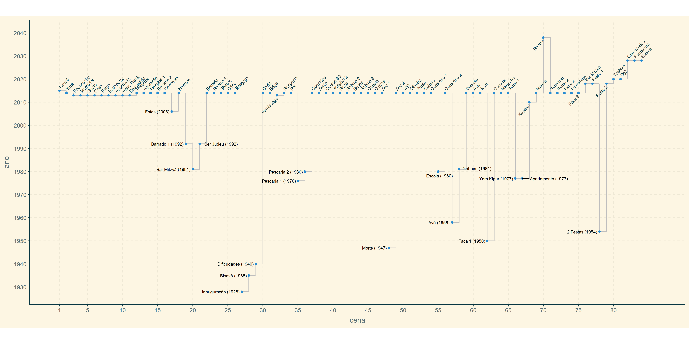

<!-- README.md is generated from README.Rmd. Please edit that file -->

Load required libraries

```{r}
suppressPackageStartupMessages(library(tidyverse))
#library(googlesheets4)
library(ggrepel)
library(ggthemes)
library(ggthemr)
```

```{r,echo=F,eval=F}
url_escaleta <- "https://docs.google.com/spreadsheets/d/1ihrKLlfM3YidL0RlhlNGN3ZdLXArdR_o8ABX8Orw_2s"
gs_id <- as_sheets_id(url_escaleta)
df_escaleta <- read_sheet(gs_id,"v1")
```

Loads screenplay scene list

```{r,message=F}
df_escaleta <- read_csv("escaleta.csv")
```

```{r,echo=F,results='as is'}
knitr::kable(df_escaleta%>%head(4))
```

Make sure all scene names are unique

```{r}
df_escaleta %>% count(`Abrev Cena`) %>% count(n)
```

Counting scenes per year

```{r}
df_escaleta %>%
  ggplot(aes(x=`Ano da Cena`)) +
  geom_bar(stat="count") +
  coord_flip()
```

Data Wrangles to prepare plot

```{r}
df_ren <- df_escaleta %>%
  rename(ano=`Ano da Cena`,
         cena=`Numero da Cena`,
         abrev=`Abrev Cena`,
         nome=`Nome da Cena`) %>%
  arrange(cena)

abrev_kap <- "Kaparot|Festa 2|Faca 3|Vernissage|Rabina"
kap <- df_ren%>%
  filter(abrev%>%str_detect(abrev_kap))%>%
  pull(cena)

main_line <- 2010:2050
df_out <- df_ren %>% filter(!(ano%in%main_line))
df_main <- df_ren %>% filter(ano%in%main_line) %>%
  mutate(hjust=if_else(cena%in%kap,"right","left"),
         nudge_y=if_else(cena%in%kap,-1,1.5))
```

Create timeline plot

```{r,message=F}
ggthemr('solarized', type = 'outer')
timeline_plot <- df_ren %>%
  ggplot(aes(x=cena,y=ano)) +
  geom_step(color="gray") +
  geom_point() +
  geom_text(aes(x=cena,y=nudge_y+ano,label=abrev,hjust=hjust),
            angle=45,size=2.5,
            inherit.aes=F,
            data=df_main) +
  geom_text_repel(aes(x=cena,y=ano,label=sprintf("%s (%d)",abrev,ano)),size=2.5,
                  hjust="left",inherit.aes=F,
                  data=df_out) +
  coord_fixed(ratio=.33
              ,ylim=c(min(df_ren$ano),2040)
              ,xlim=c(1,nrow(df_ren)+2)
              ) +
  scale_y_continuous(breaks=seq(1900,2040,10)) +
  scale_x_continuous(breaks=c(1,seq(5,max(df_ren$cena),5))) +
  theme(axis.text.y = element_text(angle = 0, hjust = 1))
```

```{r,eval=F}
ggsave("faca.png",width=16,height=8,plot=timeline_plot)
```

```{r,echo=F}

```

